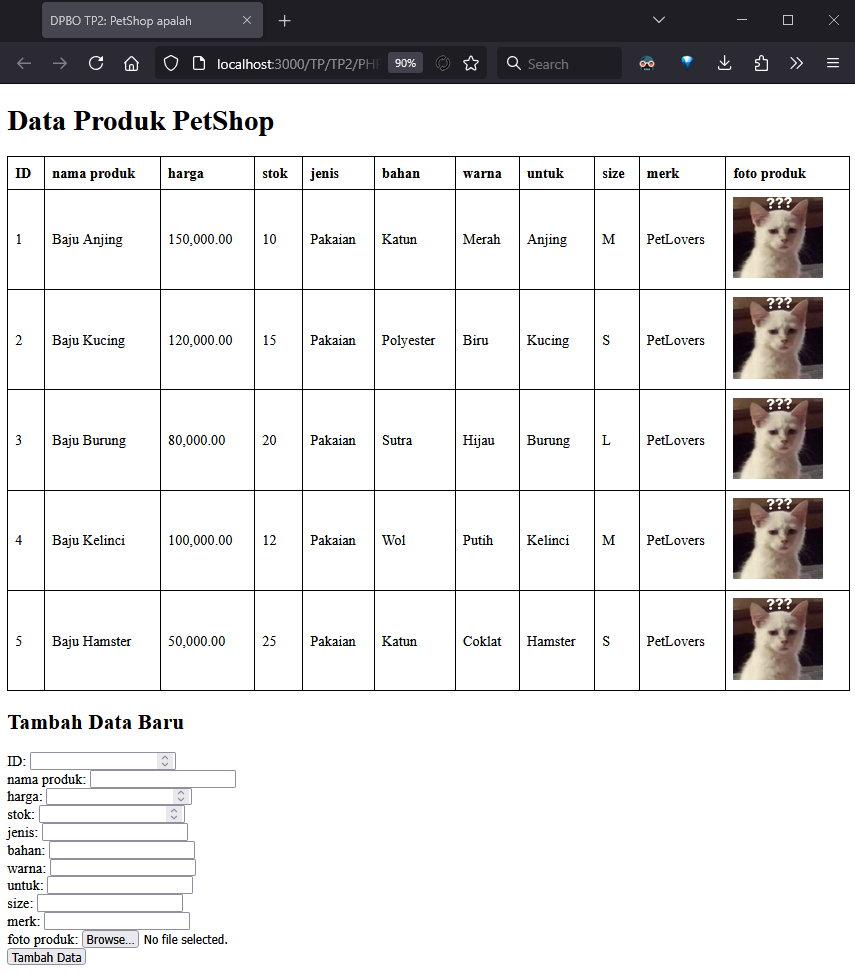

# Janji
Saya Zakiyah Hasanah dengan NIM 2305274 mengerjakan Tugas Praktikum 2 dalam mata kuliah Desain dan Pemrograman Berorientasi Objek untuk keberkahanNya maka saya tidak melakukan kecurangan seperti yang telah dispesifikasikan. Aamiin.

# Diagram


# Desain Program
Program yang dibuat berbasis OOP dengan konsep *multi-level inheritance* dalam 4 bahasa pemrograman; C++, Java, PHP, dan Python. Pada semua versi, terdapat 3 class yaitu:

### 1. Class `PetShop`
- **Atribut**:
  - `id`: ID unik untuk setiap produk (integer).
  - `nama_produk`: Nama produk (string).
  - `harga_produk`: Harga produk (float).
  - `stok_produk`: Jumlah stok produk (integer).
  - `foto_produk`: Foto produk (string, khusus PHP).

### 2. Class `Aksesoris` (Inherits dari `PetShop`)
- **Atribut Tambahan**:
  - `jenis`: Jenis aksesoris (string).
  - `bahan`: Bahan aksesoris (string).
  - `warna`: Warna aksesoris (string).

### 3. Class `Baju` (Inherits dari `Aksesoris`)
- **Atribut Tambahan**:
  - `untuk`: Untuk hewan apa baju ini (string).
  - `size`: Ukuran baju (string).
  - `merk`: Merk baju (string).

<br>

# Alur Program
Program dimulai dengan membuat 5 objek awal dari class `Baju` yang di-hardcode. Data ini akan ditampilkan dalam bentuk tabel.
Setelah itu, program meminta input dari user untuk menambahkan data baru. Input yang diminta meliputi semua atribut dari class `Baju`:
   - `id`, `nama_produk`, `harga_produk`, `stok_produk`, `jenis`, `bahan`, `warna`, `untuk`, `size`, `merk`.

Program memeriksa apakah `id` yang dimasukkan sudah ada. Jika sudah ada, program akan menolak input tersebut dan meminta user untuk memasukkan `id` yang berbeda. Jika `id` valid (tidak duplikat), program akan membuat objek baru dari class `Baju` dan menambahkannya ke dalam array/list data.

Setelah data baru ditambahkan, program akan menampilkan kembali seluruh data dalam bentuk tabel yang telah diperbarui.

### Fitur Tambahan (PHP)
Pada versi PHP, data ditampilkan dalam bentuk tabel HTML. Form input menggunakan metode POST untuk menerima data dari user. Jika `id` duplikat, program akan menampilkan pesan error menggunakan *alert*.

## Dokumentasi

### Dokumentasi CPP
```
cd CPP/Program/
g++ *.cpp -o a&&./a < ../../input.txt 
```


### Dokumentasi Java
```
cd Java/Program/
javac Main.java && java Main < ../../input.txt
```


### Dokumentasi PHP
Tampilan biasa:



Setelah add (berhasil):


### Dokumentasi Python
```
cd Python/Program/
py main.py < ../../input.txt 
```

